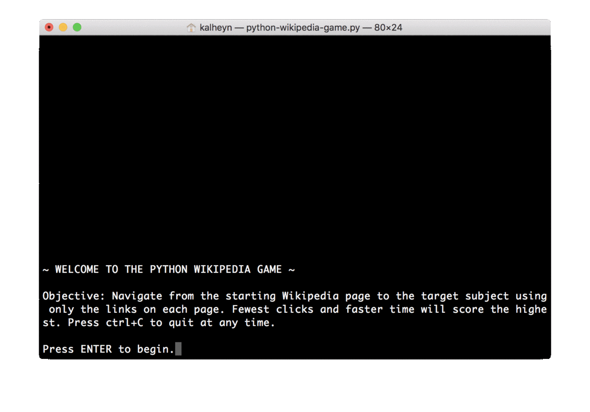

# Python Wikipedia Game
"The Wiki Game, also known as the Wikipedia race, is a hypertextual game designed to work specifically with Wikipedia. It requires only a computer, Internet access, a web browser and (optionally) a time-keeping device to play." (Source: https://en.wikipedia.org/wiki/Wikipedia:Wiki_Game)

## How To Play
1. Ensure you have Python 3 installed on your machine. 
1. Download `python-wikipedia-game.py`. 
2. Download the necessary modules using: 
  * `pip install --upgrade git+git://github.com/goldsmith/Wikipedia.git`
  * `pip isntall random`
3. Navigate to the file location. 
4. Run the program using `python python-wikipedia-game.py`. 
5. Enjoy!

## Gameplay 
A single player starts on a randomly selected or chosen article subject. The objective is to navigate to a target article solely by clicking links within each article. The player scores higher for using fewer clicks and less time. 

## Current Features
* Command-line interface :computer:
* Random or chosen starting subject :triangular_flag_on_post:
* Random or chosen target subject :checkered_flag:
* Current word :round_pushpin:
* List of link navigation :page_facing_up:
* Click counter :point_up:

## Future Features
* Stop-watch :watch:
* Session leaderboard :chart_with_upwards_trend:
  * Player initials
  * Start & end words
  * Click count
  * Finish time
